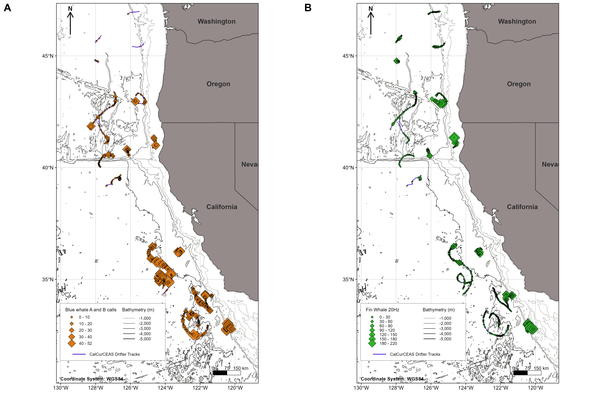
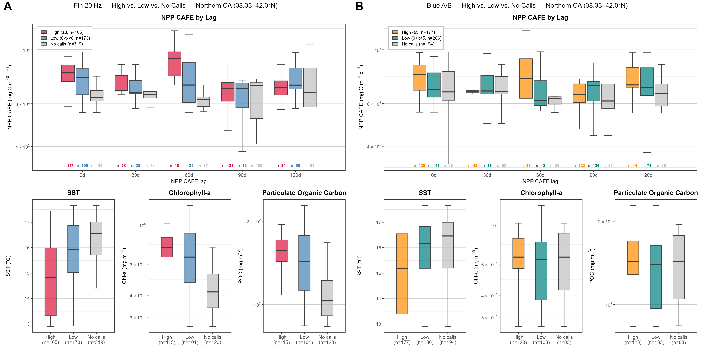

```{r, setup}
#| echo: false
#| warning: false
#| message: false

library(tidyverse)
library(here)

zone_levels <- c(
  "Columbia River",
  "Oregon",
  "Northern California",
  "Central California",
  "Southern California"
)

fmt_num <- function(x, digits = 0) {
  formatC(x, format = "f", digits = digits, big.mark = ",")
}

fmt_pct <- function(n, denominator, digits = 1) {
  paste0(formatC(100 * n / denominator, format = "f", digits = digits), "%")
}

as_flag <- function(x) {
  if (is.logical(x)) return(x)
  if (is.numeric(x)) return(!is.na(x) & x != 0)
  str_to_lower(str_squish(as.character(x))) %in% c("true", "t", "1", "yes", "y")
}

inline_list <- function(x) {
  x <- as.character(x)
  if (length(x) == 0) return("")
  if (length(x) == 1) return(x)
  if (length(x) == 2) return(paste(x, collapse = " and "))
  paste0(paste(x[-length(x)], collapse = ", "), ", and ", x[length(x)])
}

pick_col <- function(data, candidates, label) {
  hit <- intersect(candidates, names(data))
  if (length(hit) == 0) {
    stop(
      "Could not find ", label, ". Expected one of: ",
      paste(candidates, collapse = ", ")
    )
  }
  hit[[1]]
}

standardize_call_type <- function(x) {
  key <- str_to_lower(str_squish(as.character(x)))

  case_when(
    key %in% c("blue a", "blue whale a", "a") ~ "Blue whale A",
    key %in% c("blue b", "blue whale b", "b", "bb") ~ "Blue whale B",
    key %in% c("blue d", "blue whale d", "d") ~ "Blue whale D",
    str_detect(key, "fin") & str_detect(key, "20") ~ "Fin whale 20 Hz",
    str_detect(key, "fin") & str_detect(key, "40") ~ "Fin whale 40 Hz",
    str_detect(key, "sei") ~ "Sei whale downsweep",
    TRUE ~ as.character(x)
  )
}
```

```{r, import-and-summarize}
#| echo: false
#| warning: false
#| message: false

# Final public-facing data products used on this page.
validated_hourly <- read_csv(
  here(
    "supplement",
    "BaleenWhales",
    "CalCurCEAS_baleen_validated_hourly_presence_absence.csv"
  ),
  show_col_types = FALSE
)

performance_pooled <- read_csv(
  here(
    "supplement",
    "BaleenWhales",
    "CalCurCEAS_DeepAcoustics_performance_pooled_by_calltype.csv"
  ),
  show_col_types = FALSE
)

call_activity <- read_csv(
  here(
    "supplement",
    "BaleenWhales",
    "CalCurCEAS_baleen_retained_automated_hourly_call_activity.csv"
  ),
  show_col_types = FALSE
)

environmental_hourly <- read_csv(
  here(
    "supplement",
    "BaleenWhales",
    "CalCurCEAS_baleen_environmental_hourly.csv"
  ),
  show_col_types = FALSE
)

# -------------------------------------------------------------------------
# Validated hourly occurrence
# -------------------------------------------------------------------------
required_validated_cols <- c(
  "deployment",
  "geographic_zone",
  "validated_analysis_hour",
  "blue_whale_present",
  "fin_whale_present",
  "sei_whale_present"
)

missing_validated_cols <- setdiff(required_validated_cols, names(validated_hourly))
if (length(missing_validated_cols) > 0) {
  stop(
    "Validated hourly dataset is missing: ",
    paste(missing_validated_cols, collapse = ", ")
  )
}

validated_analysis <- validated_hourly %>%
  mutate(
    validated_analysis_hour = as_flag(validated_analysis_hour),
    blue_whale_present = as.integer(as_flag(blue_whale_present)),
    fin_whale_present = as.integer(as_flag(fin_whale_present)),
    sei_whale_present = as.integer(as_flag(sei_whale_present)),
    geographic_zone = factor(geographic_zone, levels = zone_levels)
  ) %>%
  filter(validated_analysis_hour)

if (any(is.na(validated_analysis$geographic_zone))) {
  stop("At least one Validated Analysis Hour has an unrecognized geographic zone.")
}

occurrence_overall <- validated_analysis %>%
  summarise(
    validated_hours = n(),
    n_deployments = n_distinct(deployment),
    blue_positive_hours = sum(blue_whale_present),
    fin_positive_hours = sum(fin_whale_present),
    sei_positive_hours = sum(sei_whale_present)
  )

species_deployment_occurrence <- validated_analysis %>%
  group_by(deployment) %>%
  summarise(
    blue = any(blue_whale_present == 1),
    fin = any(fin_whale_present == 1),
    sei = any(sei_whale_present == 1),
    .groups = "drop"
  ) %>%
  summarise(
    blue_deployments = sum(blue),
    fin_deployments = sum(fin),
    sei_deployments = sum(sei)
  )

occurrence_by_zone_numeric <- validated_analysis %>%
  group_by(geographic_zone) %>%
  summarise(
    validated_hours = n(),
    blue_positive_hours = sum(blue_whale_present),
    fin_positive_hours = sum(fin_whale_present),
    sei_positive_hours = sum(sei_whale_present),
    .groups = "drop"
  ) %>%
  mutate(
    blue_occurrence_pct = 100 * blue_positive_hours / validated_hours,
    fin_occurrence_pct = 100 * fin_positive_hours / validated_hours,
    sei_occurrence_pct = 100 * sei_positive_hours / validated_hours
  )

blue_max_zone <- occurrence_by_zone_numeric %>%
  slice_max(blue_occurrence_pct, n = 1, with_ties = FALSE) %>%
  pull(geographic_zone) %>%
  as.character()

fin_max_zone <- occurrence_by_zone_numeric %>%
  slice_max(fin_occurrence_pct, n = 1, with_ties = FALSE) %>%
  pull(geographic_zone) %>%
  as.character()

occurrence_table <- occurrence_by_zone_numeric %>%
  transmute(
    `Geographic zone` = as.character(geographic_zone),
    `Validated hours` = fmt_num(validated_hours),
    `Blue whale positive hours, n (%)` = paste0(
      fmt_num(blue_positive_hours), " (",
      formatC(blue_occurrence_pct, format = "f", digits = 1), "%)"
    ),
    `Fin whale positive hours, n (%)` = paste0(
      fmt_num(fin_positive_hours), " (",
      formatC(fin_occurrence_pct, format = "f", digits = 1), "%)"
    ),
    `Sei whale positive hours, n (%)` = paste0(
      fmt_num(sei_positive_hours), " (",
      formatC(sei_occurrence_pct, format = "f", digits = 1), "%)"
    )
  )

occurrence_total_row <- tibble(
  `Geographic zone` = "Total",
  `Validated hours` = fmt_num(occurrence_overall$validated_hours),
  `Blue whale positive hours, n (%)` = paste0(
    fmt_num(occurrence_overall$blue_positive_hours), " (",
    fmt_pct(
      occurrence_overall$blue_positive_hours,
      occurrence_overall$validated_hours
    ), ")"
  ),
  `Fin whale positive hours, n (%)` = paste0(
    fmt_num(occurrence_overall$fin_positive_hours), " (",
    fmt_pct(
      occurrence_overall$fin_positive_hours,
      occurrence_overall$validated_hours
    ), ")"
  ),
  `Sei whale positive hours, n (%)` = paste0(
    fmt_num(occurrence_overall$sei_positive_hours), " (",
    fmt_pct(
      occurrence_overall$sei_positive_hours,
      occurrence_overall$validated_hours
    ), ")"
  )
)

occurrence_table <- bind_rows(occurrence_table, occurrence_total_row)

# -------------------------------------------------------------------------
# Detector performance
# -------------------------------------------------------------------------
names(performance_pooled) <- names(performance_pooled) %>%
  str_to_lower() %>%
  str_replace_all("[^a-z0-9]+", "_") %>%
  str_replace_all("^_+|_+$", "")

perf_call_col <- pick_col(
  performance_pooled,
  c("call_type", "calltype", "call_class", "target_class", "annotation", "class", "label"),
  "detector-performance call-type column"
)
perf_precision_col <- pick_col(
  performance_pooled,
  c("precision", "pooled_precision"),
  "detector-performance precision column"
)
perf_recall_col <- pick_col(
  performance_pooled,
  c("recall", "pooled_recall"),
  "detector-performance recall column"
)
perf_f1_col <- pick_col(
  performance_pooled,
  c("f1_score", "f1score", "f1", "pooled_f1_score", "pooled_f1"),
  "detector-performance F1 column"
)

performance_numeric <- performance_pooled %>%
  transmute(
    call_type = standardize_call_type(.data[[perf_call_col]]),
    precision = as.numeric(.data[[perf_precision_col]]),
    recall = as.numeric(.data[[perf_recall_col]]),
    f1 = as.numeric(.data[[perf_f1_col]])
  ) %>%
  mutate(
    call_type = factor(
      call_type,
      levels = c(
        "Blue whale A",
        "Blue whale B",
        "Blue whale D",
        "Fin whale 20 Hz",
        "Fin whale 40 Hz",
        "Sei whale downsweep"
      )
    ),
    retained = f1 >= 0.80
  ) %>%
  arrange(call_type)

if (any(is.na(performance_numeric$call_type))) {
  stop("One or more detector-performance call types could not be standardized.")
}

retained_call_types <- performance_numeric %>%
  filter(retained) %>%
  pull(call_type) %>%
  as.character()

not_retained_call_types <- performance_numeric %>%
  filter(!retained) %>%
  pull(call_type) %>%
  as.character()

performance_table <- performance_numeric %>%
  transmute(
    `Call type` = as.character(call_type),
    Precision = formatC(precision, format = "f", digits = 3),
    Recall = formatC(recall, format = "f", digits = 3),
    `F1-score` = formatC(f1, format = "f", digits = 3),
    `Automated call-level analysis` = if_else(retained, "Retained", "Not retained")
  )

# -------------------------------------------------------------------------
# Relative automated call activity
# -------------------------------------------------------------------------
required_activity_cols <- c(
  "deployment",
  "geographic_zone",
  "usable_audio_minutes",
  "blue_a_count",
  "blue_b_count",
  "fin_20hz_count"
)

missing_activity_cols <- setdiff(required_activity_cols, names(call_activity))
if (length(missing_activity_cols) > 0) {
  stop(
    "Retained automated call-activity dataset is missing: ",
    paste(missing_activity_cols, collapse = ", ")
  )
}

call_activity <- call_activity %>%
  mutate(
    geographic_zone = factor(geographic_zone, levels = zone_levels),
    across(
      c(usable_audio_minutes, blue_a_count, blue_b_count, fin_20hz_count),
      as.numeric
    )
  )

if (any(is.na(call_activity$geographic_zone))) {
  stop("At least one call-activity hour has an unrecognized geographic zone.")
}

activity_overall <- call_activity %>%
  summarise(
    n_deployments = n_distinct(deployment),
    usable_hours = sum(usable_audio_minutes, na.rm = TRUE) / 60,
    blue_a_count = sum(blue_a_count, na.rm = TRUE),
    blue_b_count = sum(blue_b_count, na.rm = TRUE),
    fin_20hz_count = sum(fin_20hz_count, na.rm = TRUE)
  )

activity_by_zone_numeric <- call_activity %>%
  group_by(geographic_zone) %>%
  summarise(
    usable_hours = sum(usable_audio_minutes, na.rm = TRUE) / 60,
    blue_a_count = sum(blue_a_count, na.rm = TRUE),
    blue_b_count = sum(blue_b_count, na.rm = TRUE),
    fin_20hz_count = sum(fin_20hz_count, na.rm = TRUE),
    .groups = "drop"
  ) %>%
  mutate(
    blue_a_rate = blue_a_count / usable_hours,
    blue_b_rate = blue_b_count / usable_hours,
    fin_20hz_rate = fin_20hz_count / usable_hours
  )

activity_table <- activity_by_zone_numeric %>%
  transmute(
    `Geographic zone` = as.character(geographic_zone),
    `Usable recordings (h)` = fmt_num(usable_hours, 1),
    `Blue A detections/h` = fmt_num(blue_a_rate, 2),
    `Blue B detections/h` = fmt_num(blue_b_rate, 2),
    `Fin 20 Hz detections/h` = fmt_num(fin_20hz_rate, 2)
  )

activity_total_row <- tibble(
  `Geographic zone` = "Total",
  `Usable recordings (h)` = fmt_num(activity_overall$usable_hours, 1),
  `Blue A detections/h` = fmt_num(
    activity_overall$blue_a_count / activity_overall$usable_hours,
    2
  ),
  `Blue B detections/h` = fmt_num(
    activity_overall$blue_b_count / activity_overall$usable_hours,
    2
  ),
  `Fin 20 Hz detections/h` = fmt_num(
    activity_overall$fin_20hz_count / activity_overall$usable_hours,
    2
  )
)

activity_table <- bind_rows(activity_table, activity_total_row)

fin_activity_max_zone <- activity_by_zone_numeric %>%
  slice_max(fin_20hz_rate, n = 1, with_ties = FALSE) %>%
  pull(geographic_zone) %>%
  as.character()

# -------------------------------------------------------------------------
# Environmental dataset dimensions
# -------------------------------------------------------------------------
if (!"deployment" %in% names(environmental_hourly)) {
  stop("Environmental hourly dataset is missing the deployment column.")
}

environmental_n_hours <- nrow(environmental_hourly)
environmental_n_deployments <- n_distinct(environmental_hourly$deployment)
```

This page summarizes key results from the blue, fin, and sei whale analyses conducted using drifting acoustic recorder data collected during the 2024 California Current Cetacean and Ecosystem Assessment Survey (CalCurCEAS). Results are presented from two complementary analytical products: a manually validated hourly occurrence dataset used to characterize acoustic presence, and automated call-level detections used to examine relative acoustic activity for call types with sufficient detector performance.

::: callout-note
Hourly geographic-zone assignments were based on the drifting recorder's position during each hour. Because CalCurCEAS sampling progressed generally from north to south between August and December 2024, differences among geographic zones represent combined spatial and temporal variation rather than seasonally standardized regional comparisons.
:::

## Validated hourly occurrence

After data-quality screening and conversion of usable recordings to complete clock-hour bins, the validated occurrence dataset contained **`r fmt_num(occurrence_overall$validated_hours)` Validated Analysis Hours** from **`r occurrence_overall$n_deployments` deployments**. Blue whale vocalizations were confirmed during **`r fmt_num(occurrence_overall$blue_positive_hours)` hours (`r fmt_pct(occurrence_overall$blue_positive_hours, occurrence_overall$validated_hours)`)**, fin whale vocalizations during **`r fmt_num(occurrence_overall$fin_positive_hours)` hours (`r fmt_pct(occurrence_overall$fin_positive_hours, occurrence_overall$validated_hours)`)**, and sei whale vocalizations during **`r fmt_num(occurrence_overall$sei_positive_hours)` hours (`r fmt_pct(occurrence_overall$sei_positive_hours, occurrence_overall$validated_hours)`)**. Blue whales were detected on **`r species_deployment_occurrence$blue_deployments` of `r occurrence_overall$n_deployments`** analyzed deployments, fin whales on **`r species_deployment_occurrence$fin_deployments` of `r occurrence_overall$n_deployments`**, and calls attributed to sei whales on **`r species_deployment_occurrence$sei_deployments` of `r occurrence_overall$n_deployments`**.

```{r}
#| label: tbl-baleen-occurrence

knitr::kable(
  occurrence_table,
  caption = "Validated hourly acoustic occurrence of blue, fin, and sei whales by geographic zone during CalCurCEAS 2024.",
  align = c("l", "c", "c", "c", "c")
)
```

Blue whale occurrence was very low during Columbia River sampling and increased substantially during Oregon and California sampling, with the highest proportional hourly occurrence in **`r blue_max_zone`**. Fin whale vocalizations were common throughout the survey and reached their highest proportional occurrence during **`r fin_max_zone`** sampling. Sei whale vocalizations were less frequent on an hourly basis but were detected across all five geographic zones and most analyzed deployments.

{#fig-baleen-hourly-occurrence fig-alt="Three-panel time series showing validated hourly acoustic occurrence of blue, fin, and sei whales by geographic zone during CalCurCEAS 2024." width="100%"}

Call-type-specific and deployment-level timing is shown in the regional acoustic-scene figures archived in the [`_figs/BaleenWhales/`](https://github.com/SAEL-SWFSC/CalCurCEAS-2024-Drifter-Analysis/tree/main/_figs/BaleenWhales) directory.

## Detector performance on novel CalCurCEAS data

The final DeepAcoustics **Network 17, 400-Hz TinyYOLO** detector was evaluated using a stratified 20% manual review of novel CalCurCEAS recordings. Precision, recall, and F1-score were calculated from pooled true-positive, false-positive, and false-negative counts across novel deployments.

A pooled **F1-score of at least 0.80** was used as the criterion for retaining call classes for unreviewed automated call-level analyses. This criterion retained **`r inline_list(retained_call_types)`**. **`r inline_list(not_retained_call_types)`** remained available in the manually validated hourly occurrence dataset but were not used for quantitative analyses of unreviewed automated call counts.

```{r}
#| label: tbl-baleen-performance

knitr::kable(
  performance_table,
  caption = "Call-level performance of the final TinyYOLO DeepAcoustics network on novel CalCurCEAS recordings by call type.",
  align = c("l", "c", "c", "c", "l")
)
```

Deployment-level performance results and the pooled performance dataset are available with the [baleen whale supplementary products](https://github.com/SAEL-SWFSC/CalCurCEAS-2024-Drifter-Analysis/tree/main/supplement/BaleenWhales), and the reproducible evaluation workflow is in [`_code/baleen_whales/detector_performance/`](https://github.com/SAEL-SWFSC/CalCurCEAS-2024-Drifter-Analysis/tree/main/_code/baleen_whales/detector_performance).

## Relative automated call activity

Automated detections of the three retained call classes were summarized as a secondary index of relative acoustic activity. Across the **`r activity_overall$n_deployments` novel deployments** included in this analysis, the detector identified **`r fmt_num(activity_overall$blue_a_count)` blue whale A calls**, **`r fmt_num(activity_overall$blue_b_count)` blue whale B calls**, and **`r fmt_num(activity_overall$fin_20hz_count)` fin whale 20 Hz calls** over **`r fmt_num(activity_overall$usable_hours, 1)` hours** of usable acoustic recording effort.

Effort-normalized detection rates varied among geographic zones within each call type. Blue whale A and B rates were lowest in the northern portion of the survey and higher during California sampling. Fin whale 20 Hz activity was present throughout the study area and had its highest regional detection rate during **`r fin_activity_max_zone`** sampling.

```{r}
#| label: tbl-baleen-relative-activity

knitr::kable(
  activity_table,
  caption = "Relative automated call activity for blue whale A and B calls and fin whale 20 Hz calls by geographic zone during CalCurCEAS 2024.",
  align = c("l", "c", "c", "c", "c")
)
```

{#fig-baleen-relative-activity fig-alt="Two maps showing the spatial magnitude of automated blue whale A and B calls and fin whale 20 Hz calls along CalCurCEAS drifter tracks." width="100%"}

::: callout-important
Automated detection rates are indices of **relative acoustic activity within call type**. They should not be interpreted as whale abundance, whale density, or directly compared among call types because call production, detectability, and detector performance differ among classes.
:::

## Environmental context

Environmental comparisons were exploratory and were used to place variation in automated call activity in oceanographic context. The finalized environmental dataset contains **`r fmt_num(environmental_n_hours)` hourly bins** from **`r environmental_n_deployments` novel deployments**. For blue whale A/B and fin whale 20 Hz activity, hours were classified separately within each California geographic zone as high-call, low-call, or no-call using the zone-specific 75th percentile of hourly call counts.

Across pooled comparisons, call-positive hours generally occurred in deeper and cooler waters and under higher chlorophyll-a and particulate organic carbon conditions than hours with no retained detections. Fin whale 20 Hz activity showed the clearest environmental separation, including relatively high activity under cooler conditions and elevated chlorophyll-a and particulate organic carbon in Northern California. Blue whale A/B patterns were weaker and less consistent. Net primary productivity (NPP CAFE) was also examined at concurrent and nominal 30-, 60-, 90-, and 120-day lags, but no single lag consistently separated higher and lower call activity across species or geographic zones.

{#fig-baleen-environment fig-alt="Environmental boxplots comparing high, low, and no-call activity for fin whale 20 Hz and blue whale A/B calls in Northern California." width="100%"}

These relationships are descriptive. Survey location, season, deployment identity, environmental conditions, and acoustic activity varied concurrently, so the observed patterns are not interpreted as evidence of habitat preference or causal environmental drivers.

Additional environmental summaries, the Central and Southern California boxplots, and the selected Southern California four-panel spatial context figure are available in [`_figs/BaleenWhales/`](https://github.com/SAEL-SWFSC/CalCurCEAS-2024-Drifter-Analysis/tree/main/_figs/BaleenWhales) and the [environmental analysis workflow](https://github.com/SAEL-SWFSC/CalCurCEAS-2024-Drifter-Analysis/tree/main/_code/baleen_whales/environmental_analysis).

## Data products

The public-facing baleen whale products are maintained in [`supplement/BaleenWhales/`](https://github.com/SAEL-SWFSC/CalCurCEAS-2024-Drifter-Analysis/tree/main/supplement/BaleenWhales). The principal reusable products are:

| Product | Description |
|----|----|
| [`CalCurCEAS_baleen_validated_hourly_presence_absence.csv`](https://github.com/SAEL-SWFSC/CalCurCEAS-2024-Drifter-Analysis/blob/main/supplement/BaleenWhales/CalCurCEAS_baleen_validated_hourly_presence_absence.csv) | Final manually validated hourly presence/absence dataset for blue, fin, and sei whale call types and species-level occurrence. |
| [`CalCurCEAS_baleen_retained_automated_hourly_call_activity.csv`](https://github.com/SAEL-SWFSC/CalCurCEAS-2024-Drifter-Analysis/blob/main/supplement/BaleenWhales/CalCurCEAS_baleen_retained_automated_hourly_call_activity.csv) | Final hourly automated call-activity dataset for Blue A, Blue B, and Fin 20 Hz, including exact usable acoustic effort. |
| [`CalCurCEAS_baleen_environmental_hourly.csv`](https://github.com/SAEL-SWFSC/CalCurCEAS-2024-Drifter-Analysis/blob/main/supplement/BaleenWhales/CalCurCEAS_baleen_environmental_hourly.csv) | Hourly call-activity and environmental dataset used for the exploratory environmental analyses. |
| [`CalCurCEAS_DeepAcoustics_performance_pooled_by_calltype.csv`](https://github.com/SAEL-SWFSC/CalCurCEAS-2024-Drifter-Analysis/blob/main/supplement/BaleenWhales/CalCurCEAS_DeepAcoustics_performance_pooled_by_calltype.csv) | Pooled detector-performance metrics by focal call type. |
| [`CalCurCEAS_DeepAcoustics_performance_by_deployment_calltype.csv`](https://github.com/SAEL-SWFSC/CalCurCEAS-2024-Drifter-Analysis/blob/main/supplement/BaleenWhales/CalCurCEAS_DeepAcoustics_performance_by_deployment_calltype.csv) | Deployment-level TP, FP, FN, precision, recall, and F1 results for novel recordings. |
| [`CalCurCEAS_environmental_summary_by_zone_activity.csv`](https://github.com/SAEL-SWFSC/CalCurCEAS-2024-Drifter-Analysis/blob/main/supplement/BaleenWhales/CalCurCEAS_environmental_summary_by_zone_activity.csv) | Regional environmental summaries by call metric and high-, low-, and no-call activity category. |
| [`CalCurCEAS_PacificLF_TinyYOLO_final.mat`](https://github.com/SAEL-SWFSC/CalCurCEAS-2024-Drifter-Analysis/blob/main/supplement/BaleenWhales/CalCurCEAS_PacificLF_TinyYOLO_final.mat) | Final Network 17, 400-Hz TinyYOLO detector used for the CalCurCEAS low-frequency baleen whale analysis. |
| [`CalCurCEAS_PacificLF_TinyYOLO_final_README.md`](https://github.com/SAEL-SWFSC/CalCurCEAS-2024-Drifter-Analysis/blob/main/supplement/BaleenWhales/CalCurCEAS_PacificLF_TinyYOLO_final_README.md) | Detector documentation, including training provenance, software requirements, detection threshold, and performance limitations. |

Reproducible scripts and workflow documentation are organized under [`_code/baleen_whales/`](https://github.com/SAEL-SWFSC/CalCurCEAS-2024-Drifter-Analysis/tree/main/_code/baleen_whales). Final rendered figures are archived under [`_figs/BaleenWhales/`](https://github.com/SAEL-SWFSC/CalCurCEAS-2024-Drifter-Analysis/tree/main/_figs/BaleenWhales).
