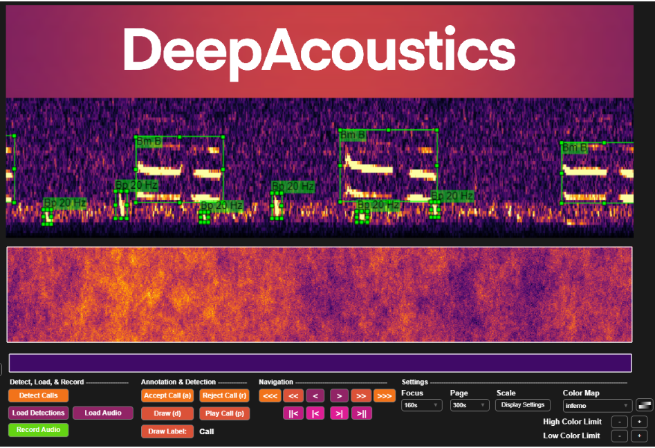

## Summary

[DeepAcoustics](https://github.com/Ocean-Science-Analytics/DeepAcoustics), a deep learning software package, was used to develop and test detection models for blue, fin, and sei whale calls. Two model architectures within DeepAcoustics were evaluated: TinyYOLO and ResNet. Based on model performance, a TinyYOLO model was selected to process CalCurCEAS deployments that were not used during training. The selected model was used to detect blue whale A, B, and D calls, fin whale 20 Hz and 40 Hz calls, and sei whale downsweeps.

Model detections were binned by hour and call type to create standardized presence/absence summaries for each drifting recorder deployment. A subset of these hourly outputs was manually reviewed to evaluate model accuracy and compare performance among call types. Call-count summaries were also generated during processing, but interpretation of count-based metrics will depend on model performance and the availability of finalized validated datasets.

## DeepAcoustics

{fig-alt="An image of DeepAcoustic, an open-access software, on startup of the program" fig-align="center"}

DeepAcoustics, an open-access deep learning software package, was used to train and test multi-class, low-frequency detection networks for baleen whale calls. For the CalCurCEAS project, training data were compiled from multiple recording platforms across the North Pacific, including sonobuoys, cabled observatories, high-frequency acoustic recording packages (HARPs), and drifting acoustic recorders, including some CalCurCEAS deployments. Calls from blue whales (A, B, and D calls), fin whales (20 Hz and 40 Hz calls), and sei whales (downsweeps) were first annotated in Raven Pro and then used as model training data, along with representative noise samples from the same recordings.

Multiple TinyYOLO and ResNet models were developed and tested to compare performance across the target baleen whale call types. Based on these comparisons, a TinyYOLO model was selected to process CalCurCEAS deployments that were not used during training. Recordings from these novel deployments were decimated to 400 Hz prior to model processing, and the resulting model outputs were converted into standardized Raven-style selection tables.

Model outputs were then processed in R to generate hourly binned summaries by deployment and call type. These hourly products included presence/absence indicators for each target call type and provided the primary unit for comparing automated detections with manual review results. Call-count summaries were also generated during processing, but interpretation of count-based metrics will depend on model performance and the availability of finalized validated datasets.

## Manual Validation

Manual review was conducted at two levels: detection-level validation and hourly presence/absence validation.

For detection-level validation, approximately 20% of each deployment was selected for manual review to evaluate model accuracy. Review files were selected using a stratified random sampling approach that distributed review effort across the full deployment period. This helped avoid concentrating manual review in only one portion of a deployment and allowed model performance to be assessed across different times, locations, and acoustic conditions.

During detection-level review, the original TinyYOLO Raven selection tables were manually corrected. False positive detections were deleted, missed calls were added, and mislabeled detections were corrected to the appropriate call type. These reviewed selection tables were then compared with the original model outputs to evaluate model performance and identify true positives, false positives, and false negatives by call type.

In addition to detection-level validation, model outputs were also binned by hour and manually reviewed for call-type presence/absence. Each hourly bin was checked to confirm whether the target call types were present. When a call type was missing from the hourly summary but present in the data, it was added. This produced a manually reviewed hourly presence/absence dataset by deployment and call type.

## Model Performance Metrics

Model performance was evaluated by comparing the original TinyYOLO outputs with the manually reviewed results. At the detection level, reviewed Raven selection tables were used to identify false positives, missed calls, and mislabeled detections. These comparisons provided information on how well the model detected and classified individual call events within the manually reviewed subset of each deployment.

Model performance was also evaluated at the hourly-bin level by comparing automated TinyYOLO presence/absence outputs with the manually reviewed hourly presence/absence results. For each call type, hourly bins were classified as true positives, false positives, false negatives, or true negatives based on agreement between model output and manual review.

These comparisons were used to calculate performance metrics such as precision, recall/sensitivity, specificity, and overall agreement by call type and deployment. Precision described how often model-positive hourly bins were confirmed during manual review, while recall/sensitivity described how often manually confirmed positive hours were detected by the model. Specificity described how well the model identified hourly bins without the target call type.

## Code and Reproducible Products

R scripts were developed to clean and combine DeepAcoustics outputs across deployments, remove or flag unusable recording periods, incorporate deployment and recovery metadata where needed, summarize detections by hour and call type, and generate exploratory figures. These scripts will be uploaded to the repository as analysis files are finalized.
